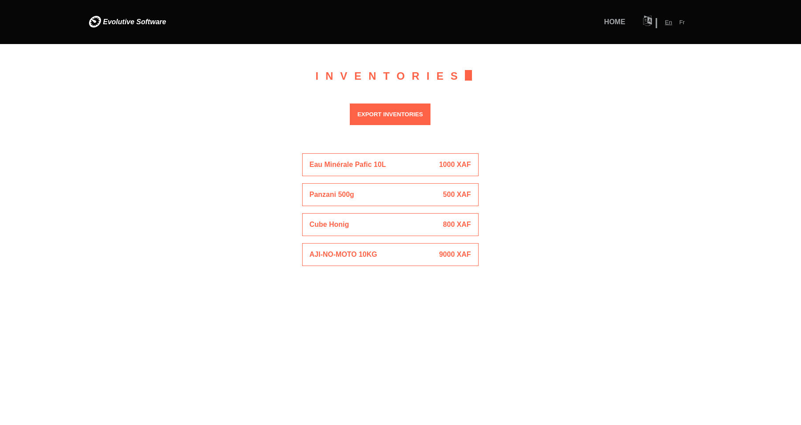

# evoSoftInventory

Il s'agit d'une application de gestion des stocks multilingue. Comment fonctionne-t-elle ?

-   Exécutez l'application localement sur votre machine
-   Ouvrez le lien du projet (http://localhost:3000) dans le navigateur.
-   Vous pouvez maintenant voir la liste des inventaires et le bouton pour les exporter.
-   Cliquez sur l'un des inventaires pour ouvrir sa page détaillée.
-   Vous êtes maintenant sur la page détaillée de l'inventaire qui montre la liste des magasins avec leur inventaire et un bouton pour mettre à jour leur inventaire.
-   Cliquez sur le bouton de mise à jour pour ouvrir la fenêtre modale contenant le formulaire de mise à jour.
-   Sélectionnez maintenant le magasin, puis définissez le stock pour ce magasin, et enregistrez le résultat. Vous pouvez également modifier la date de l'inventaire.

**_demo.mp4(La vidéo contient quelques imperfections)_**
[](./demo.mp4)

# Exécuter localement en mode développement

Pour commencer, il suffit de cloner le dépôt et de lancer npm install && npm run dev :

```bash
npm install
npm run dev
```
